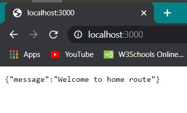

# REST in a nutshell

## Build your own REST API in JavaScript

---

Before diving into anything further, what exactly is REST and API ? Well, by definition, REST stands for `REpresentational State Transfer` and API stands for `Application Programming Interface`.
But wait, what the hell is it anyways !

Application programming interface, as the name suggests, is a way for two applications or services to talk with each other and REST is one the implementations of it. There are many ways by which communication can take place, like the SOAP API, Plain text, HTML etc.

The primary idea behind REST is the decoupling of frontend and backend, or simply the transfer of data instead of user interface. In the world of web it is very common to see the use of HTML for data transfer. But, not every Ui uses HTML but these applications are still connected to the web for eg. the mobile apps. REST can also be used along with HTML as in Single Page Applications. A commonly used example of a Single Page Application maybe `Gmail`.
Besides these, REST can also be used to create service APIs like the Google Maps API, OpenWeather Api, OpenMovieDB API etc

---

## Enough of theory for now. Let's get our hands dirty, actually coding something

---

It is assumed that the reader has basic knowledge of JavaScript and some of the ES6 features since we will be using NodeJS to build a simple REST API

Download NodeJS [here](https://nodejs.org/)

Let's get coding 🥳🥳🥳

## 1. Start an empty project

In a freshly created directory, initialize an NPM project by `$ npm init`
The wizard can be skipped by using `-y` flag as in `$ npm init -y`

## 2. Installing the Express package

Express is an essential part of most of the modern day NodeJS application. It is a server framework which we will use to create our APIs
Express can be installed by

```bash
$ npm install express --save
or simply
$ npm i express
```

Now we can start using it

## 3. Actually creating the API xD

In the project folder, create a file `index.js`.
Many people also name it as `app.js` or `server.js`. But thats not an issue at all. For now, lets go with index
`index.js`

```js
const express = require('express');
const app = express();
```

The first line of the code, pulls in the express package that we just installed in the second step and stores it in the express variable.
Now that we have Express ready, now we need to spin up an Express server. It can be done by executing express as a function and store it in a variable called `app`

Everything going great, our express server is ready. But it still needs to listen to the incoming requests and to send responses too.
This is done by the `app.listen()` method as follows

```js
app.listen(3000, () => {
  console.log('Serving at PORT 3000');
});
```

The `app.listen()` method takes two positional agruments, the first one being the port on which it is supposed to listen to the incoming requests, here `3000` and the second one being a callback function which is triggered after the app starts listening.

Now to start this server, we need to run

```bash
$ node index.js
```

We can test if it is actually working by simply going to the url `http://localhost:3000` from any browser.
But, it still gives an error in the browser `Cannot GET /`
Don't worry, this error is not because we made any mistake while creating the server but it is because we havent defined in our code what to do when the route `/` is hit

We can create different routes for our server with different HTTP method very easily using Express.

```js
app.get('/', (req, res) => {
  res.json({
    message: 'Welcome to home route',
  });
});
```

As we can see in the code above, we have created a GET route, the route being the home url itself.
The `app` variable provides us various method such as `GET, POST, PUT, DELETE`
Here, the `app.get` method takes two parameters, the first one being the name of the route and the second one is the callback function. The callback functon inturn takes two arguments ( or sometimes even 3, if we are using any middlewares ), `req` as in request and `res` as in repsonse. The `req` variable contains all the data that the user has sent to us and the `res` variable is used to send data back to the user if any, as we have done here in the `res.json()` method. We send back an object to the user that has a key of message and its value.
Now, its time for testing.
Restart the node instance running in the terminal and again navigate to the browser and hit the url `http://localhost:3000`
You would be able to get a message that we have just added in our JavaScript code, just like this


But the limitiation of a browser is that it cannot directly send any request other than `GET`.
So we need to use other tools like `POSTMAN` to test our APIs efficiently as the allow differet kinds of requests.

### 🎉Congratulations, You created your very first REST API !!! 🥳🥳🥳

<br>
<br>
<br>

#### To Be Continued ...
